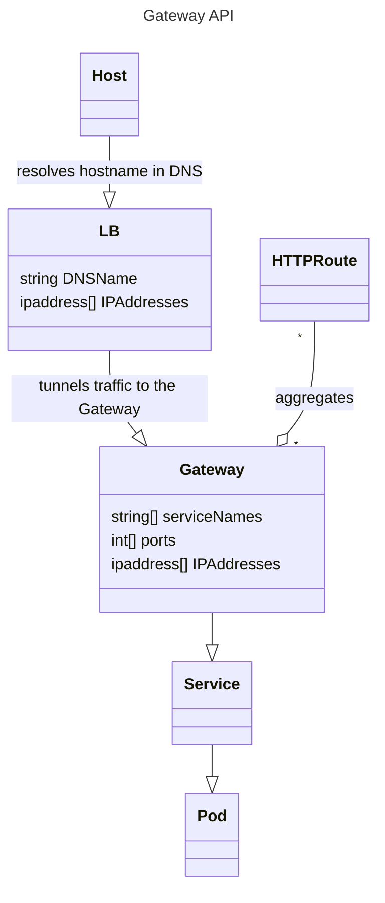

# Cloud Provider :: mDNS

[](https://github.com/MrMatAP/cloud-provider-mdns/actions/workflows/ci.yml)

> This is a proof of concept. Do not consider it to be free of issues. It works reasonably well for registering names
> in your local Kubernetes cluster you use for engineering, such as the one created by [kube-eng](https://github.com/mrmatap/kube-eng).

This little Python script watches for Ingresses, Gateways and HTTP Routes in the Kubernetes cluster you have configured as your current context.
.  It then works out the fully qualified domain name and external IP address to be registered it in multicast and/or unicast DNS towards the IP. cloud-provider-mdns is intended to simplify 
local engineering. If you choose to only use Multicast DNS only then there is no need to run a local DNS server. Basically run this, 
watch it find new registrations, then type their names into your browser.

## How to run this

> It is assumed you have something like [cloud-provider-kind](https://github.com/kubernetes-sigs/cloud-provider-kind)
> that assigns IP addresses to your Gateways so they are accessible from your host.
> It is not necessary to activate the virtual environment you installed the script in.

1. One-time: Build and install as described in the “How to build this” section below.
2. Start your Kubernetes cluster and make sure your Kubernetes configuration has it set as its current context
3. In a separate terminal, start cloud-provider-mdns and keep it running. Hit Ctrl-C to stop it.

    ```shell
    $ /path/to/virtualenv/bin/cloud-provider-mdns
    ```
   
4. Declare a HTTPRoute, Ingress or VirtualService
5. Watch the output of cloud-provider-mdns
6. Type the name into your browser

Registration is done in multicast DNS by default. If you wish to additionally populate a unicast nameserver then
you must specify it's IP, tsig key name and secret using the CLI. A usable example unicast nameserver configuration is created
by [kube-eng](https://github.com/mrmatap/kube-eng).

### Configuration

You can configure cloud-provider-mdns by providing a configuration file at `~/etc/cloud-provider-mdns.json` or using
environment variables.

| Field              | Environment Variable                 | Default Value | Description                                                                                                                                                                 |
|--------------------|--------------------------------------|---------------|-----------------------------------------------------------------------------------------------------------------------------------------------------------------------------|
| multicast_enable   | CLOUD_PROVIDER_MDNS_MULTICAST_ENABLE | True          | Enables registration in multicast DNS **for names that end in `.local`**                                                                                                    |
| unicast_enable     | CLOUD_PROVIDER_MDNS_UNICAST_ENABLE   | False         | Enables registration in unicast DNS **for all names that end in the specified domain**                                                                                      |
| unicast_ip         | CLOUD_PROVIDER_MDNS_UNICAST_IP       | 127.0.0.1     | IP address on which the Unicast DNS server listens on for DDNS updates                                                                                                      |
| unicast_domain     | CLOUD_PROVIDER_MDNS_UNICAST_DOMAIN   | k8s           | DNS Domain to update. This the zone name the unicast DNS server is authoritative for. The FQDNs to be registered can be anything, including subdomains of that domain name. |
| unicast_key_name   | CLOUD_PROVIDER_MDNS_KEY_NAME         | <empty>       | Name of the TSIG key authorised to update the unicast_domain                                                                                                                |
| unicast_key_secret | CLOUD_PROVIDER_MDNS_KEY_SECRET       | <empty>       | The TSIG key authorised to update the unicast_domain                                                                                                                        |


## How to build this

### Interactively

The project uses the [uv build tool](https://docs.astral.sh/uv/). Install it first, then simply run `uv build --wheel`.

All interactive builds default their version to '0.0.0.dev0', which we use as a marker that this is a locally produced
build which should not go into production. You can override this behaviour by setting the 'MRMAT_VERSION' environment
variable to the desired version, but doing so is discouraged.

### Continuous Integration

GitHub Actions will trigger builds for pushes and pull requests. A merge push onto the main branch will additionally
create a release.

All builds on branches other than main will have their version calculated from the MAJOR, MINOR and GITHUB_RUN_NUMBER
environment variables with a '.dev0' suffix appended. You can set the MAJOR and MINOR variables in
`.github/workflows/build.yml`. Builds resulting from a merge push onto the main branch will not have a suffix.

The resulting code is aware of its version at build-time via the extra `src/ci` module, which is explicitly excluded from
the distribution. Pythons own `importlib.metadata` is then used to make the version available at runtime.


## Issues & Limitations

* This has been tested on a Mac, Docker, cloud-provider-kind, Istio and the new Kubernetes Gateway API
* There are some unclean shutdowns

## Notes

### Gateway API Complexities

Applications within a cluster configured to use the Gateway API declare HTTPRoutes rather than Ingress resources.
HTTPRoutes then "bind" to Gateway resources. Gateway resources may have multiple IP addresses and multiple listeners (for ports and TLS). 

A Gateway with multiple IP addresses and the names of a HTTPRoute registered against all those leads to round-robin
behaviour in DNS, which is not ideal as it becomes non-deterministic which IP address (and
therefore which Gateway IP address is resolved for the client. A realistic scenario where this is desirable is when you have a multi-homed cluster where, say, internal users are sent to one Gateway and external users to another. You would then register the same DNS name in different views or DNS servers. This scenario could be solved by this tool recognising an annotation on the Gateway resource explicitly declaring or overriding the DNS view or server that the desired name is to be registered in.

A HTTPRoute by default binds to all listeners of a Gateway. The listener of a Gateway declares the port and protocol, but it re-uses the single IP address of that Gateway against which the names of the HTTPRoute are registered. HTTProutes
can declare to be bound to a single listener via `sectionName` or `port`. The port binding is obvious when either of
these is declared. When neither `sectionName` nor `port` is declared then this tool will assume port 443 (if the
gateway has any listener on that port) or port 80. If neither port 443 nor port 80 is declared in the Gateways listener
then the tool issues a warning and will not register the name in DNS.
Clients that rely on session stickiness will not work.



#### One-To-One  

A single HTTPRoute binds to a single Gateway. This is a simple case because all declared hostnames are registered
against that single Gateway. However, the Gateway can have multiple addresses declared, which will lead to round-robin DNS entries. 

The behaviour of this tool is to register all names declared in the HTTPRoute against all addresses of the Gateway in DNS.

#### Many-To-One  

Many HTTPRoutes bind to a single Gateway. This is a simple case because all declared hostnames are registered
against the IP addresses of that single Gateway. This is the most common scenario. However, the Gateway can have multiple addresses declared, which will lead to round-robin DNS entries.

The behaviour of this tool is to register all names declared in the HTTPRoute against all addresses of the Gateway in DNS.

#### Many-To-Many 

A single HTTPRoute binds to multiple Gateways. This is a more complex case because the declared hostnames are
registered against the IP addresses of all Gateways. The tool will register the same hostname multiple times, for all IP addresses of all Gateways.
