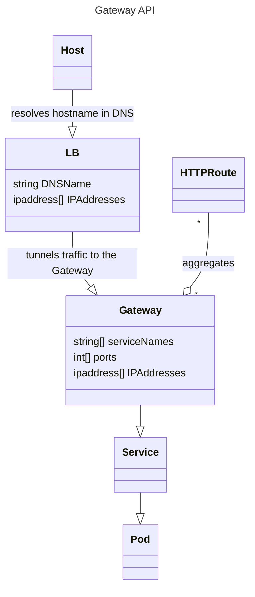

# Cloud Provider :: mDNS

[](https://github.com/MrMatAP/cloud-provider-mdns/actions/workflows/build.yml)

> This is a proof of concept. Do not consider it to be free of issues. It works reasonably well for registering names
> in your local Kubernetes cluster you use for engineering, such as the one created by [kube-eng](https://github.com/mrmatap/kube-eng).

This little Python script watches for Gateways and HTTP Routes part of the [Kubernetes Gateway API](https://gateway-api.sigs.k8s.io)
in the Kubernetes cluster you have configured as your current context. It then works out the hostname from the HTTP route
and registers it in multicast and optionally unicast DNS towards the IP address of the Gateway. cloud-provider-mdns is intended to simplify 
local engineering, without the need of running a DNS server or manually hacking your hosts file. Basically run this, 
watch it find new registrations, then type their names into your browser.

## How to run this

> It is assumed you have something like [cloud-provider-kind](https://github.com/kubernetes-sigs/cloud-provider-kind)
> that assigns IP addresses to your Gateways so they are accessible from your host.
> It is not necessary to activate the virtual environment you installed the script in.

1. One-time: Build and install as described in the “How to build this” section below.
2. Start your Kubernetes cluster and make sure your Kubernetes configuration has it set as its current context
3. In a separate terminal, start cloud-provider-mdns and keep it running. Hit Ctrl-C to stop it.

    ```shell
    $ /path/to/virtualenv/bin/cloud-provider-mdns
    ```
   
4. Declare a HTTPRoute with a hostname that ends in '.local'
5. Watch the output of cloud-provider-mdns
6. Type the name into your browser

Registration is done in multicast DNS by default. If you wish to additionally populate a unicast nameserver then
you must specify it's IP, tsig key name and secret using the CLI. A usable example unicast namesever configuration is created
by [kube-eng](https://github.com/mrmatap/kube-eng).

## How to build this

Clone this repository, create a Python virtualenv (you'll need Python >= 3.12), then build and install:

```shell
$ python3 -mvenv /path/to/virtualenv
$ . /path/to/virtualenv/bin/activate

(venv) $ pip install -r requirements.dev.txt -r requirements.txt
... many lines omitted

(venv) $ python3 -mbuild -n --wheel
... many lines omitted
Successfully built cloud_provider_mdns-0.0.0.dev0-py3-none-any.whl

(venv) $ pip3 install dist/cloud_provider_mdns-*.whl
... many lines omitted
```

It is best to install the script into the virtual environment. If you do not like that, you can deactivate the
virtual environment and install into whatever your Python considers the user installation directory. On Linux, that
directory is going to be `~/.local`. On MacOs it's `~/Library/Python/<Python Version>`. If you don't like that either,
you can permanently set the PYTHONUSERBASE environment variable to wherever things are to be installed. Current Python
is very picky about you installing outside a virtual environment, so you must specify the `--user` and
`--break-system-packages` options to pip when doing that.

## Issues & Limitations

* This has been tested on a Mac, Docker, cloud-provider-kind, Istio and the new Kubernetes Gateway API
* There are some unclean shutdowns

## Notes

### Gateway API Complexities

Applications within a cluster configured to use the Gateway API declare HTTPRoutes rather than Ingress resources.
HTTPRoutes then "bind" to Gateway resources. Gateway resources may have multiple IP addresses and multiple listeners (for ports and TLS). 

A Gateway with multiple IP addresses and the names of a HTTPRoute registered against all those leads to round-robin
behaviour in DNS, which is not ideal as it becomes non-deterministic which IP address (and
therefore which Gateway IP address is resolved for the client. A realistic scenario where this is desirable is when you have a multi-homed cluster where, say, internal users are sent to one Gateway and external users to another. You would then register the same DNS name in different views or DNS servers. This scenario could be solved by this tool recognising an annotation on the Gateway resource explicitly declaring or overriding the DNS view or server that the desired name is to be registered in.

A HTTPRoute by default binds to all listeners of a Gateway. The listener of a Gateway declares the port and protocol, but it re-uses the single IP address of that Gateway against which the names of the HTTPRoute are registered. HTTProutes
can declare to be bound to a single listener via `sectionName` or `port`. The port binding is obvious when either of
these is declared. When neither `sectionName` nor `port` is declared then this tool will assume port 443 (if the
gateway has any listener on that port) or port 80. If neither port 443 nor port 80 is declared in the Gateways listener
then the tool issues a warning and will not register the name in DNS.
Clients that rely on session stickiness will not work.



#### One-To-One  

A single HTTPRoute binds to a single Gateway. This is a simple case because all declared hostnames are registered
against that single Gateway. However, the Gateway can have multiple addresses declared, which will lead to round-robin DNS entries. 

The behaviour of this tool is to register all names declared in the HTTPRoute against all addresses of the Gateway in DNS.

#### Many-To-One  

Many HTTPRoutes bind to a single Gateway. This is a simple case because all declared hostnames are registered
against the IP addresses of that single Gateway. This is the most common scenario. However, the Gateway can have multiple addresses declared, which will lead to round-robin DNS entries.

The behaviour of this tool is to register all names declared in the HTTPRoute against all addresses of the Gateway in DNS.

#### Many-To-Many 

A single HTTPRoute binds to multiple Gateways. This is a more complex case because the declared hostnames are
registered against the IP addresses of all Gateways. The tool will register the same hostname multiple times, for all IP addresses of all Gateways.
